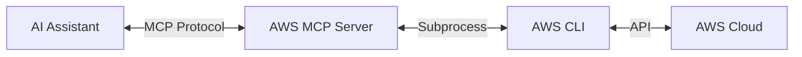
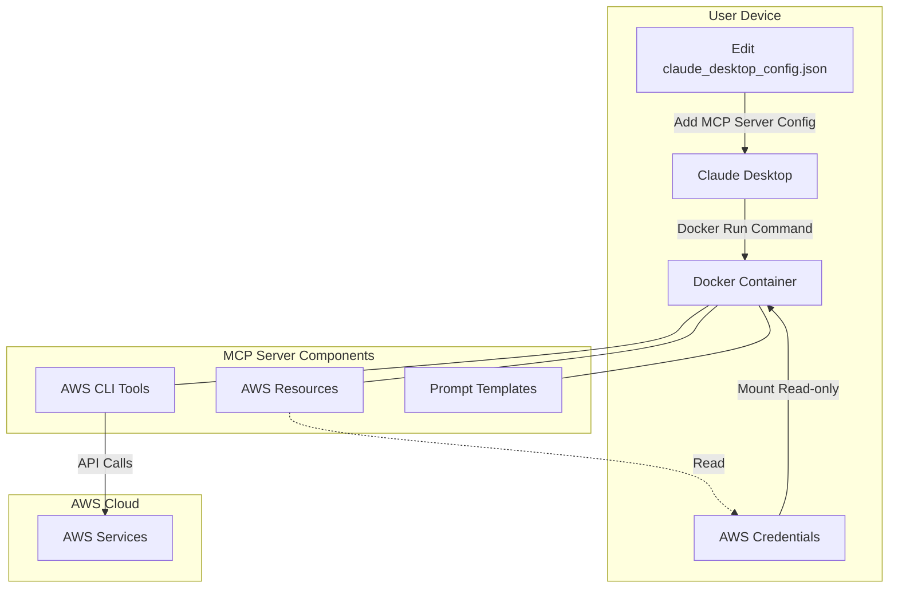

# AWS Model Context Protocol (MCP) Server

[](https://github.com/alexei-led/aws-mcp-server/actions/workflows/ci.yml)
[](https://codecov.io/gh/alexei-led/aws-mcp-server)
[](https://github.com/alexei-led/aws-mcp-server)
[](https://github.com/alexei-led/aws-mcp-server/pkgs/container/aws-mcp-server/versions)
[](https://github.com/alexei-led/aws-mcp-server/pkgs/container/aws-mcp-server)
[](https://smithery.ai/server/@alexei-led/aws-mcp-server)

A lightweight service that enables AI assistants to execute AWS CLI commands through the Model Context Protocol (MCP).

## Overview

The AWS MCP Server provides a bridge between MCP-aware AI assistants (like Claude Desktop, Cursor, Windsurf) and the AWS CLI. It enables these assistants to:

1. **Retrieve AWS CLI documentation** - Get detailed help on AWS services and commands
2. **Execute AWS CLI commands** - Run commands and receive formatted results optimized for AI consumption



## Demo

[Demo](https://private-user-images.githubusercontent.com/1898375/424996801-b51ddc8e-5df5-40c4-8509-84c1a7800d62.mp4?jwt=eyJhbGciOiJIUzI1NiIsInR5cCI6IkpXVCJ9.eyJpc3MiOiJnaXRodWIuY29tIiwiYXVkIjoicmF3LmdpdGh1YnVzZXJjb250ZW50LmNvbSIsImtleSI6ImtleTUiLCJleHAiOjE3NDI0NzY5OTUsIm5iZiI6MTc0MjQ3NjY5NSwicGF0aCI6Ii8xODk4Mzc1LzQyNDk5NjgwMS1iNTFkZGM4ZS01ZGY1LTQwYzQtODUwOS04NGMxYTc4MDBkNjIubXA0P1gtQW16LUFsZ29yaXRobT1BV1M0LUhNQUMtU0hBMjU2JlgtQW16LUNyZWRlbnRpYWw9QUtJQVZDT0RZTFNBNTNQUUs0WkElMkYyMDI1MDMyMCUyRnVzLWVhc3QtMSUyRnMzJTJGYXdzNF9yZXF1ZXN0JlgtQW16LURhdGU9MjAyNTAzMjBUMTMxODE1WiZYLUFtei1FeHBpcmVzPTMwMCZYLUFtei1TaWduYXR1cmU9NjgwNTM4MDVjN2U4YjQzN2Y2N2Y5MGVkMThiZTgxYWEyNzBhZTlhMTRjZDY3ZDJmMzJkNmViM2U4M2U4MTEzNSZYLUFtei1TaWduZWRIZWFkZXJzPWhvc3QifQ.tIb7uSkDpSaspIluzCliHS8ATmlzkvEnF3CiClD-UGQ)

The video demonstrates using Claude Desktop with AWS MCP Server to create a new AWS EC2 instance with AWS SSM agent installed.

## Features

- **Command Documentation** - Detailed help information for AWS CLI commands
- **Command Execution** - Execute AWS CLI commands and return human-readable results
- **Unix Pipe Support** - Filter and transform AWS CLI output using standard Unix pipes and utilities
- **AWS Resources Context** - Access to AWS profiles, regions, account information, and environment details via MCP Resources
- **Prompt Templates** - Pre-defined prompt templates for common AWS tasks following best practices
- **Docker Integration** - Simple deployment through containerization with multi-architecture support (AMD64/x86_64 and ARM64)
- **AWS Authentication** - Leverages existing AWS credentials on the host machine

## Requirements

- Docker (default) or Python 3.13+ (and AWS CLI installed locally)
- AWS credentials configured

## Getting Started

### Run Server Option 1: Using Docker (Recommended)

```bash
# Clone repository
git clone https://github.com/alexei-led/aws-mcp-server.git
cd aws-mcp-server

# Build and run Docker container
docker compose -f deploy/docker/docker-compose.yml up -d
```

The Docker image supports both AMD64/x86_64 (Intel/AMD) and ARM64 (Apple Silicon M1-M4, AWS Graviton) architectures.

> **Note**: The official image from GitHub Packages is multi-architecture and will automatically use the appropriate version for your system.
>
> ```bash
> # Use the latest stable version
> docker pull ghcr.io/alexei-led/aws-mcp-server:latest
> 
> # Or pin to a specific version (recommended for production)
> docker pull ghcr.io/alexei-led/aws-mcp-server:1.0.0
> ```
>
> **Docker Image Tags**:
>
> - `latest`: Latest stable release
> - `x.y.z` (e.g., `1.0.0`): Specific version
> - `sha-abc123`: Development builds, tagged with Git commit SHA

### Run Server Option 2: Using Python

```bash
# Clone repository
git clone https://github.com/alexei-led/aws-mcp-server.git
cd aws-mcp-server

# Set up virtual environment
python -m venv venv
source venv/bin/activate  # On Windows: venv\Scripts\activate

# Install in development mode
pip install -e .

# Run the server
python -m aws_mcp_server
```

## Configuration

The AWS MCP Server can be configured using environment variables:

| Environment Variable | Description                                  | Default   |
|----------------------|----------------------------------------------|-----------|
| `AWS_MCP_TIMEOUT`    | Command execution timeout in seconds         | 300       |
| `AWS_MCP_MAX_OUTPUT` | Maximum output size in characters            | 100000    |
| `AWS_MCP_TRANSPORT`  | Transport protocol to use ("stdio" or "sse") | stdio     |
| `AWS_PROFILE`        | AWS profile to use                           | default   |
| `AWS_REGION`         | AWS region to use                            | us-east-1 |

## Integrating with Claude Desktop

### Option 1: Manual Configuration

To manually integrate AWS MCP Server with Claude Desktop:

1. **Locate the Claude Desktop configuration file**:
   - macOS: `~/Library/Application Support/Claude/claude_desktop_config.json`
   - Windows: `%APPDATA%\Claude\claude_desktop_config.json`

2. **Edit the configuration file** to include the AWS MCP Server:
   ```json
   {
     "mcpServers": {
       "aws-mcp-server": {
         "command": "docker",
         "args": [
           "run",
           "-i",
           "--rm",
           "-v",
           "/Users/YOUR_USER_NAME/.aws:/home/appuser/.aws:ro",
           "ghcr.io/alexei-led/aws-mcp-server:latest"
         ]
       }
     }
   }
   ```
   
### Option 2: Using Smithery (under testing; do not use in production)

Another to install and configure AWS MCP Server for Claude Desktop is via [Smithery](https://smithery.ai/server/@alexei-led/aws-mcp-server):

```bash
npx -y @smithery/cli install @alexei-led/aws-mcp-server --client claude
```

This command will automatically configure Claude Desktop to use AWS MCP Server.


3. **Restart Claude Desktop** to apply the changes
   - After restarting, you should see a hammer 🔨 icon in the bottom right corner of the input box
   - This indicates that the AWS MCP Server is available for use



### Example Interactions

**Getting AWS CLI Documentation**:
```
User: What are the available options for the AWS S3 cp command?

Claude: Let me get that information for you.

The AWS S3 cp command has the following options:

NAME
    cp - Copies a local file or S3 object to another location locally or in S3.

SYNOPSIS
    cp <LocalPath> <S3Uri> or <S3Uri> <LocalPath> or <S3Uri> <S3Uri> [--acl <value>] [--cache-control <value>] ...
```

**Executing AWS CLI Commands**:
```
User: List my S3 buckets

Claude: I'll list your S3 buckets for you.

2023-10-15 14:30:45 my-bucket-1
2023-11-20 09:15:32 my-bucket-2
2024-01-05 11:22:18 my-backup-bucket
```

**Using Command Pipes**:
```
User: List my S3 buckets that have "backup" in their name and show them in alphabetical order

Claude: Let me find that for you.

2024-01-05 11:22:18 my-backup-bucket
2024-03-01 09:44:12 weekly-backup-bucket
2024-03-15 13:10:57 database-backup-bucket
```

**Accessing AWS Resources**:
```
User: What AWS regions are available for me to use?

Claude: Let me check what AWS regions are available for you.

Available regions:
- us-east-1 (US East, N. Virginia) - Currently selected
- us-east-2 (US East, Ohio)
- us-west-1 (US West, N. California)
- us-west-2 (US West, Oregon)
- eu-west-1 (EU West, Ireland)
- eu-central-1 (EU Central, Frankfurt)
- ap-northeast-1 (Asia Pacific, Tokyo)
- ap-southeast-1 (Asia Pacific, Singapore)
- ap-southeast-2 (Asia Pacific, Sydney)

You're currently using the us-east-1 region.
```

**Using Prompt Templates**:
```
User: I need to perform a security audit of my S3 buckets

Claude: I'll help you audit the security of your S3 buckets.

Here are AWS CLI commands to perform a comprehensive security audit:

# List all buckets with public access settings
aws s3api list-buckets --query 'Buckets[*].Name' --output text | xargs -I {} aws s3api get-public-access-block --bucket {}

# Check bucket policies for public access
aws s3api list-buckets --query 'Buckets[*].Name' --output text | xargs -I {} aws s3api get-bucket-policy --bucket {} 2>/dev/null

# Identify buckets without encryption
aws s3api list-buckets --query 'Buckets[*].Name' --output text | xargs -I {} aws s3api get-bucket-encryption --bucket {} 2>/dev/null

# Check for buckets without logging enabled
aws s3api list-buckets --query 'Buckets[*].Name' --output text | xargs -I {} aws s3api get-bucket-logging --bucket {} 2>/dev/null

# Verify bucket versioning status
aws s3api list-buckets --query 'Buckets[*].Name' --output text | xargs -I {} aws s3api get-bucket-versioning --bucket {}
```

## Available Prompt Templates

The AWS MCP Server includes the following pre-defined prompt templates:

### Core Operations

| Prompt                 | Description                                                   | Parameters                                          |
|------------------------|---------------------------------------------------------------|-----------------------------------------------------|
| `create_resource`      | Generate commands to create AWS resources with best practices | `resource_type`, `resource_name`                    |
| `resource_inventory`   | Create comprehensive inventory of resources                   | `service`, `region` (optional)                      |
| `troubleshoot_service` | Generate commands to troubleshoot service issues              | `service`, `resource_id`                            |
| `resource_cleanup`     | Identify and safely clean up resources                        | `service`, `criteria` (optional)                    |

### Security & Compliance

| Prompt                     | Description                                                | Parameters                                          |
|----------------------------|------------------------------------------------------------|-----------------------------------------------------|
| `security_audit`           | Audit security settings for a specific AWS service         | `service`                                           |
| `security_posture_assessment` | Comprehensive security assessment across your AWS environment | None                                          |
| `iam_policy_generator`     | Create least-privilege IAM policies                        | `service`, `actions`, `resource_pattern` (optional) |
| `compliance_check`         | Check compliance with standards                            | `compliance_standard`, `service` (optional)         |

### Cost & Performance

| Prompt               | Description                                             | Parameters                                         |
|----------------------|---------------------------------------------------------|----------------------------------------------------|
| `cost_optimization`  | Find cost optimization opportunities for a service      | `service`                                          |
| `performance_tuning` | Optimize and tune performance of AWS resources          | `service`, `resource_id`                           |

### Infrastructure & Architecture

| Prompt                      | Description                                              | Parameters                                           |
|-----------------------------|----------------------------------------------------------|------------------------------------------------------|
| `serverless_deployment`     | Deploy serverless applications with best practices       | `application_name`, `runtime` (optional)             |
| `container_orchestration`   | Set up container environments (ECS/EKS)                  | `cluster_name`, `service_type` (optional)            |
| `vpc_network_design`        | Design and implement secure VPC networking               | `vpc_name`, `cidr_block` (optional)                  |
| `infrastructure_automation` | Automate infrastructure management                       | `resource_type`, `automation_scope` (optional)       |
| `multi_account_governance`  | Implement secure multi-account strategies                | `account_type` (optional)                            |

### Reliability & Monitoring

| Prompt               | Description                                           | Parameters                                          |
|----------------------|-------------------------------------------------------|-----------------------------------------------------|
| `service_monitoring` | Set up comprehensive monitoring                       | `service`, `metric_type` (optional)                 |
| `disaster_recovery`  | Implement enterprise-grade DR solutions               | `service`, `recovery_point_objective` (optional)    |

## Security

- The server uses AWS credentials from the host machine
- All commands are validated before execution
- Timeout limits prevent long-running commands
- Commands must start with the 'aws' prefix
- Potentially dangerous commands are restricted

## Development

### Setting Up the Development Environment

```bash
# Install only runtime dependencies using pip
pip install -e .

# Install all development dependencies using pip
pip install -e ".[dev]"

# Or use uv for faster dependency management
make uv-install       # Install runtime dependencies
make uv-dev-install   # Install development dependencies
```

### Makefile Commands

The project includes a Makefile with various targets for common tasks:

```bash
# Test commands
make test             # Run tests excluding integration tests
make test-unit        # Run unit tests only (all tests except integration tests)
make test-integration # Run integration tests only (requires AWS credentials)
make test-all         # Run all tests including integration tests

# Test coverage commands
make test-coverage    # Run tests with coverage report (excluding integration tests)
make test-coverage-all # Run all tests with coverage report (including integration tests)

# Linting and formatting
make lint             # Run linters (ruff check and format --check)
make lint-fix         # Run linters and auto-fix issues where possible
make format           # Format code with ruff
```

For a complete list of available commands, run `make help`.

### Code Coverage

The project includes configuration for [Codecov](https://codecov.io) to track code coverage metrics. The configuration is in the `codecov.yml` file, which:

- Sets a target coverage threshold of 80%
- Excludes test files, setup files, and documentation from coverage reports
- Configures PR comments and status checks

Coverage reports are automatically generated during CI/CD runs and uploaded to Codecov.

### Integration Testing

Integration tests verify AWS MCP Server works correctly with actual AWS resources. To run them:

1. **Set up AWS resources**:
   - Create an S3 bucket for testing
   - Set the environment variable: `export AWS_TEST_BUCKET=your-test-bucket-name`
   - Ensure your AWS credentials are configured

2. **Run integration tests**:
   ```bash
   # Run all tests including integration tests
   make test-all
   
   # Run only integration tests
   make test-integration
   ```

Or you can run the pytest commands directly:
```bash
# Run all tests including integration tests
pytest --run-integration

# Run only integration tests
pytest --run-integration -m integration
```

## Troubleshooting

- **Authentication Issues**: Ensure your AWS credentials are properly configured
- **Connection Errors**: Verify the server is running and AI assistant connection settings are correct
- **Permission Errors**: Check that your AWS credentials have the necessary permissions
- **Timeout Errors**: For long-running commands, increase the `AWS_MCP_TIMEOUT` environment variable

## Why Deploy with Docker

### Security Benefits

- **Isolation**: The Docker container provides complete isolation - AWS CLI commands and utilities run in a contained environment, not directly on your local machine
- **Controlled Access**: The container only has read-only access to your AWS credentials
- **No Local Installation**: Avoid installing AWS CLI and supporting tools directly on your host system
- **Clean Environment**: Each container run starts with a pristine, properly configured environment

### Reliability Advantages

- **Consistent Configuration**: All required tools (AWS CLI, SSM plugin, jq) are pre-installed and properly configured
- **Dependency Management**: Avoid version conflicts between tools and dependencies
- **Cross-Platform Consistency**: Works the same way across different operating systems
- **Complete Environment**: Includes all necessary tools for command pipes, filtering, and formatting

### Other Benefits

- **Multi-Architecture Support**: Runs on both Intel/AMD (x86_64) and ARM (Apple Silicon, AWS Graviton) processors
- **Simple Updates**: Update to new versions with a single pull command
- **No Python Environment Conflicts**: Avoids potential conflicts with other Python applications on your system
- **Version Pinning**: Easily pin to specific versions for stability in production environments

## Versioning

This project uses [setuptools_scm](https://github.com/pypa/setuptools_scm) to automatically determine versions based on Git tags:

- **Release versions**: When a Git tag exists (e.g., `1.2.3`), the version will be exactly that tag
- **Development versions**: For commits without tags, a development version is generated in the format: 
  `<last-tag>.post<commits-since-tag>+g<commit-hash>.d<date>` (e.g., `1.2.3.post10+gb697684.d20250406`)

The version is automatically included in:
- Package version information
- Docker image labels
- Continuous integration builds

### Creating Releases

To create a new release version:

```bash
# Create and push a new tag
git tag -a 1.2.3 -m "Release version 1.2.3"
git push origin 1.2.3
```

The CI/CD pipeline will automatically build and publish Docker images with appropriate version tags.

For more detailed information about the version management system, see [VERSION.md](docs/VERSION.md).

## License

This project is licensed under the MIT License - see the LICENSE file for details.
