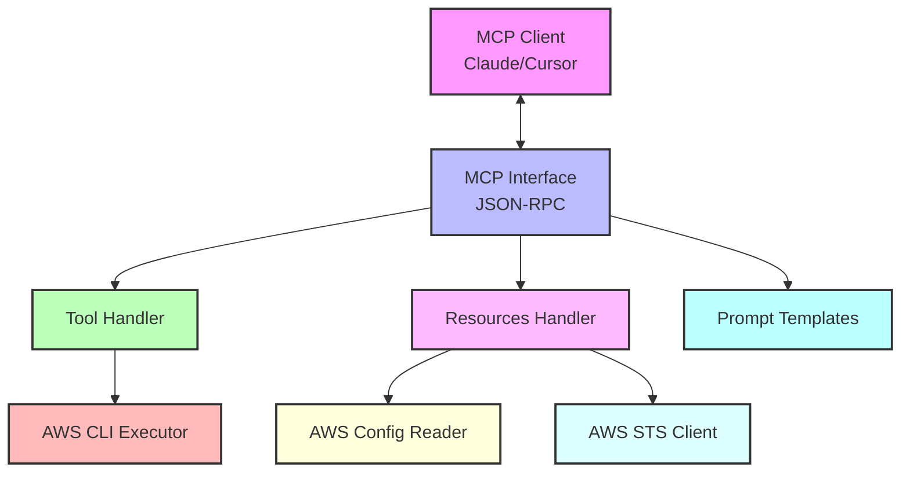

# AWS Model Context Protocol (MCP) Server Specification

## Project Overview

The **AWS MCP Server** is a lightweight service that enables users to execute AWS CLI commands through an MCP (Model Context Protocol) interface. It integrates with MCP-aware AI assistants (e.g., Claude Desktop, Cursor, Windsurf) via the [Model Context Protocol](https://modelcontextprotocol.io/), which is based on JSON-RPC 2.0. The server facilitates AWS CLI command documentation and execution, returning human-readable output optimized for AI consumption.

### Key Objectives

- **Command Documentation**: Provide detailed help information for AWS CLI commands.
- **Command Execution**: Execute AWS CLI commands and return formatted results.
- **MCP Compliance**: Fully implement the standard MCP protocol.
- **Human-Readable Output**: Ensure command output is optimized for AI assistants.
- **AWS Resource Context**: Provide access to AWS resources like profiles and regions.
- **Easy Deployment**: Prioritize Docker-based deployment for environment consistency.
- **Open Source**: Release under MIT license with GitHub repository and CI/CD.

## Core Features

### 1. Command Documentation Tool

The `describe_command` tool retrieves and formats AWS CLI help information:

- Use `aws help` and `aws <service> help` to access documentation.
- Present results in a structured, readable format optimized for AI consumption.
- Support parameter exploration to help understand command options.

**Examples:**

```
describe_command({"service": "s3"})
// Returns high-level AWS S3 service documentation

describe_command({"service": "s3", "command": "ls"})
// Returns specific documentation for the S3 ls command
```

### 2. Command Execution Tool

The `execute_command` tool runs AWS CLI commands:

- Accept complete AWS CLI command strings.
- Execute commands using the OS's AWS CLI installation.
- Format output for readability.
- Support optional parameters (timeout).
- Support Unix pipes to filter or transform output.

**Examples:**

```
execute_command({"command": "aws s3 ls"})
// Lists all S3 buckets

execute_command({"command": "aws ec2 describe-instances --region us-west-2"})
// Lists EC2 instances in the Oregon region

execute_command({"command": "aws s3api list-buckets --query 'Buckets[*].Name' --output text | sort"})
// Lists bucket names sorted alphabetically
```

### 3. AWS Context Resources

The server exposes AWS resources through the MCP Resources protocol:

- **AWS Profiles** (`aws://config/profiles`): Available AWS CLI profiles from AWS config.
- **AWS Regions** (`aws://config/regions`): List of available AWS regions.
- **AWS Region Details** (`aws://config/regions/{region}`): Detailed information about a specific region, including availability zones, geographic location, and services.
- **AWS Environment Variables** (`aws://config/environment`): Current AWS-related environment variables and credential information.
- **AWS Account Information** (`aws://config/account`): Information about the current AWS account.

These resources provide context for executing AWS commands, allowing AI assistants to suggest region-specific commands, use the correct profile, and understand the current AWS environment.

### 4. Output Formatting

Transform raw AWS CLI output into human-readable formats:

- Default to AWS CLI's default output format.
- Format complex outputs for better readability.
- Handle JSON, YAML, and text output formats.
- Support truncation for very large outputs.

### 5. Authentication Management

- Leverage existing AWS CLI authentication on the host machine.
- Support AWS profiles through command parameters.
- Provide clear error messages for authentication issues.
- Expose available profiles as MCP Resources.

### 6. Prompt Templates

Provide a collection of useful prompt templates for common AWS use cases:

- Resource creation with best practices
- Security audits
- Cost optimization
- Resource inventory
- Service troubleshooting
- IAM policy generation
- Service monitoring
- Disaster recovery
- Compliance checking
- Resource cleanup

## MCP Protocol Implementation

The server implements the MCP protocol with the following components:

### 1. Initialization Workflow

**Client Request:**

```json
{
  "jsonrpc": "2.0",
  "id": 1,
  "method": "initialize",
  "params": {
    "protocolVersion": "DRAFT-2025-v1",
    "capabilities": {
      "experimental": {},
      "resources": {}
    },
    "clientInfo": {
      "name": "Claude Desktop",
      "version": "1.0.0"
    }
  }
}
```

**Server Response:**
```json
{
  "jsonrpc": "2.0",
  "id": 1,
  "result": {
    "protocolVersion": "DRAFT-2025-v1",
    "capabilities": {
      "tools": {},
      "resources": {}
    },
    "serverInfo": {
      "name": "AWS MCP Server",
      "version": "1.0.0"
    },
    "instructions": "Use this server to retrieve AWS CLI documentation and execute AWS CLI commands."
  }
}
```

**Client Notification:**
```json
{
  "jsonrpc": "2.0",
  "method": "notifications/initialized"
}
```

### 2. Tool Definitions

The server defines two primary tools:

#### describe_command

**Request:**
```json
{
  "jsonrpc": "2.0",
  "id": 2,
  "method": "tools/describe_command",
  "params": {
    "service": "s3",
    "command": "ls"  // Optional
  }
}
```

**Response:**
```json
{
  "jsonrpc": "2.0",
  "id": 2,
  "result": {
    "help_text": "Description: Lists all your buckets or all the objects in a bucket.\n\nUsage: aws s3 ls [bucket] [options]\n\nOptions:\n  --bucket TEXT        The bucket name\n  --prefix TEXT        Prefix to filter objects\n  --delimiter TEXT     Delimiter to use for grouping\n  --max-items INTEGER  Maximum number of items to return\n  --page-size INTEGER  Number of items to return per page\n  --starting-token TEXT Starting token for pagination\n  --request-payer TEXT  Confirms that the requester knows they will be charged for the request\n\nExamples:\n  aws s3 ls\n  aws s3 ls my-bucket\n  aws s3 ls my-bucket --prefix folder/\n"
  }
}
```

#### execute_command

**Request:**
```json
{
  "jsonrpc": "2.0",
  "id": 3,
  "method": "tools/execute_command",
  "params": {
    "command": "aws s3 ls --region us-west-2",
    "timeout": 60  // Optional
  }
}
```

**Response:**
```json
{
  "jsonrpc": "2.0",
  "id": 3,
  "result": {
    "output": "2023-10-15 14:30:45 my-bucket-1\n2023-11-20 09:15:32 my-bucket-2",
    "status": "success"
  }
}
```

### 3. Resource Definitions

The server provides access to AWS resources:

#### aws_profiles

**Request:**
```json
{
  "jsonrpc": "2.0",
  "id": 4,
  "method": "resources/aws_profiles"
}
```

**Response:**
```json
{
  "jsonrpc": "2.0",
  "id": 4,
  "result": {
    "profiles": [
      { "name": "default", "is_current": true },
      { "name": "dev" },
      { "name": "prod" }
    ]
  }
}
```

#### aws_regions

**Request:**
```json
{
  "jsonrpc": "2.0",
  "id": 5,
  "method": "resources/aws_regions"
}
```

**Response:**
```json
{
  "jsonrpc": "2.0",
  "id": 5,
  "result": {
    "regions": [
      { "name": "us-east-1", "description": "US East (N. Virginia)", "is_current": true },
      { "name": "us-east-2", "description": "US East (Ohio)" },
      { "name": "us-west-1", "description": "US West (N. California)" },
      { "name": "us-west-2", "description": "US West (Oregon)" }
    ]
  }
}
```

#### aws_region_details

**Request:**
```json
{
  "jsonrpc": "2.0",
  "id": 8,
  "method": "resources/aws_region_details",
  "params": {
    "region": "us-east-1"
  }
}
```

**Response:**
```json
{
  "jsonrpc": "2.0",
  "id": 8,
  "result": {
    "code": "us-east-1",
    "name": "US East (N. Virginia)",
    "geographic_location": {
      "continent": "North America",
      "country": "United States",
      "city": "Ashburn, Virginia"
    },
    "availability_zones": [
      {
        "name": "us-east-1a",
        "state": "available",
        "zone_id": "use1-az1",
        "zone_type": "availability-zone"
      },
      {
        "name": "us-east-1b",
        "state": "available",
        "zone_id": "use1-az2",
        "zone_type": "availability-zone"
      }
    ],
    "services": ["ec2", "s3", "lambda", "dynamodb", "rds"],
    "is_current": true
  }
}
```

#### aws_environment

**Request:**
```json
{
  "jsonrpc": "2.0",
  "id": 6,
  "method": "resources/aws_environment"
}
```

**Response:**
```json
{
  "jsonrpc": "2.0",
  "id": 6,
  "result": {
    "aws_profile": "default",
    "aws_region": "us-east-1",
    "aws_access_key_id": "AKI***********", // Masked for security
    "has_credentials": true,
    "credentials_source": "environment" // Can be "environment", "profile", "instance-profile", etc.
  }
}
```

#### aws_account

**Request:**
```json
{
  "jsonrpc": "2.0",
  "id": 7,
  "method": "resources/aws_account"
}
```

**Response:**
```json
{
  "jsonrpc": "2.0",
  "id": 7,
  "result": {
    "account_id": "123456789012",
    "account_alias": "my-org",
    "organization_id": "o-abc123"
  }
}
```

### 4. Error Handling

The server returns standardized JSON-RPC error responses:

```json
{
  "jsonrpc": "2.0",
  "id": 3,
  "error": {
    "code": -32603,
    "message": "Internal error",
    "data": "AWS CLI command failed: Unable to locate credentials"
  }
}
```

**Standard Error Codes:**
- `-32600`: Invalid Request
- `-32601`: Method Not Found
- `-32602`: Invalid Parameters
- `-32603`: Internal Error

## Architecture

### Component Architecture



### Current Components

1. **MCP Interface**
   - Implements JSON-RPC 2.0 protocol endpoints
   - Handles MCP initialization and notifications
   - Routes tool requests to appropriate handlers
   - Implemented using FastMCP library

2. **Tool Handler**
   - Processes `describe_command` requests
   - Processes `execute_command` requests
   - Validates parameters
   - Handles command execution with timeout

3. **AWS CLI Executor**
   - Executes AWS CLI commands via subprocess
   - Captures standard output and error streams
   - Handles command timing and timeout
   - Supports piped commands with Unix utilities

4. **Prompt Templates**
   - Provides pre-defined prompt templates for common AWS tasks
   - Helps ensure best practices in AWS operations
   - Supports various use cases like security, cost optimization, etc.

### New Components for Resources

5. **Resources Handler**
   - Manages MCP Resources capabilities
   - Provides access to AWS-specific resources
   - Handles resource requests and responds with resource data

6. **AWS Config Reader**
   - Reads AWS configuration files (~/.aws/config, ~/.aws/credentials)
   - Provides information about available profiles
   - Respects AWS credential precedence rules

7. **AWS STS Client**
   - Obtains AWS account information
   - Verifies credential validity
   - Provides current identity information

## Implementation Details

### 1. Server Implementation

**Current Python Implementation:**

```python
from mcp.server.fastmcp import Context, FastMCP
from pydantic import Field

# Create the FastMCP server
mcp = FastMCP(
    "AWS MCP Server",
    instructions=INSTRUCTIONS,
    version=SERVER_INFO["version"],
)

# Register tools
@mcp.tool()
async def describe_command(
    service: str = Field(description="AWS service (e.g., s3, ec2)"),
    command: str | None = Field(description="Command within the service", default=None),
    ctx: Context | None = None,
) -> CommandHelpResult:
    """Get AWS CLI command documentation."""
    # Implementation...

@mcp.tool()
async def execute_command(
    command: str = Field(description="Complete AWS CLI command to execute"),
    timeout: int | None = Field(description="Timeout in seconds", default=None),
    ctx: Context | None = None,
) -> CommandResult:
    """Execute an AWS CLI command."""
    # Implementation...

# Register prompts
register_prompts(mcp)
```

**Resource Implementation:**

```python
# Register all MCP resources
def register_resources(mcp):
    """Register all resources with the MCP server instance."""
    logger.info("Registering AWS resources")

    @mcp.resource(uri="aws://config/profiles", mime_type="application/json")
    async def aws_profiles() -> dict:
        """Get available AWS profiles."""
        profiles = get_aws_profiles()
        current_profile = os.environ.get("AWS_PROFILE", "default")
        return {
            "profiles": [
                {"name": profile, "is_current": profile == current_profile}
                for profile in profiles
            ]
        }

    @mcp.resource(uri="aws://config/regions", mime_type="application/json")
    async def aws_regions() -> dict:
        """Get available AWS regions."""
        regions = get_aws_regions()
        current_region = os.environ.get("AWS_REGION", os.environ.get("AWS_DEFAULT_REGION", "us-east-1"))
        return {
            "regions": [
                {
                    "name": region["RegionName"],
                    "description": region["RegionDescription"],
                    "is_current": region["RegionName"] == current_region,
                }
                for region in regions
            ]
        }
    
    @mcp.resource(uri="aws://config/regions/{region}", mime_type="application/json")
    async def aws_region_details(region: str) -> dict:
        """Get detailed information about a specific AWS region."""
        return get_region_details(region)

    @mcp.resource(uri="aws://config/environment", mime_type="application/json")
    async def aws_environment() -> dict:
        """Get AWS environment information."""
        return get_aws_environment()

    @mcp.resource(uri="aws://config/account", mime_type="application/json")
    async def aws_account() -> dict:
        """Get AWS account information."""
        return get_aws_account_info()
```

### 2. Directory Structure

Current structure:

```
aws-mcp-server/
├── src/
│   ├── aws_mcp_server/
│   │   ├── __init__.py
│   │   ├── __main__.py
│   │   ├── cli_executor.py
│   │   ├── config.py
│   │   ├── prompts.py
│   │   ├── server.py
│   │   └── tools.py
├── tests/
│   ├── unit/
│   │   └── ...
│   └── integration/
│       └── ...
├── deploy/
│   └── docker/
│       ├── Dockerfile
│       └── docker-compose.yml
├── docs/
│   └── VERSION.md
├── pyproject.toml
└── README.md
```

Extended structure with resources:

```
aws-mcp-server/
├── src/
│   ├── aws_mcp_server/
│   │   ├── __init__.py
│   │   ├── __main__.py
│   │   ├── cli_executor.py
│   │   ├── config.py
│   │   ├── prompts.py
│   │   ├── resources.py        # New file for resource implementations
│   │   ├── server.py
│   │   └── tools.py
├── tests/
│   ├── unit/
│   │   ├── test_resources.py   # New tests for resources
│   │   └── ...
│   └── integration/
│       └── ...
├── deploy/
│   └── docker/
│       ├── Dockerfile
│       └── docker-compose.yml
├── docs/
│   └── VERSION.md
├── pyproject.toml
└── README.md
```

### 3. Error Handling Strategy

Implement comprehensive error handling for common scenarios:

- **AWS CLI Not Installed**: Check for AWS CLI presence at startup
- **Authentication Failures**: Return clear error messages with resolution steps
- **Permission Issues**: Clarify required AWS permissions
- **Invalid Commands**: Validate commands before execution
- **Timeout Handling**: Set reasonable command timeouts (default: 300 seconds)
- **Resource Access Failures**: Handle failures to access AWS resources gracefully

## Deployment Strategy

### 1. Docker Deployment (Primary Method)

**Dockerfile:**
```dockerfile
FROM python:3.13-slim

# Install AWS CLI v2
RUN apt-get update && apt-get install -y \
    unzip \
    curl \
    less \
    && curl "https://awscli.amazonaws.com/awscli-exe-linux-x86_64.zip" -o "awscliv2.zip" \
    && unzip awscliv2.zip \
    && ./aws/install \
    && rm -rf awscliv2.zip aws \
    && apt-get clean \
    && rm -rf /var/lib/apt/lists/*

WORKDIR /app

# Copy application files
COPY pyproject.toml .
COPY uv.lock .
RUN pip install uv && uv pip sync --system uv.lock

COPY src/ ./src/

# Command to run the MCP server
ENTRYPOINT ["python", "-m", "aws_mcp_server"]
```

**Docker Compose:**
```yaml
version: '3'
services:
  aws-mcp-server:
    build: .
    volumes:
      - ~/.aws:/root/.aws:ro  # Mount AWS credentials as read-only
    environment:
      - AWS_PROFILE=default   # Optional: specify AWS profile
      - AWS_REGION=us-east-1  # Optional: specify AWS region
```

### 2. Alternative: Python Virtual Environment

For users who prefer direct Python installation:

```bash
# Clone repository
git clone https://github.com/username/aws-mcp-server.git
cd aws-mcp-server

# Create and activate virtual environment
python -m venv .venv
source .venv/bin/activate  # On Windows: .venv\Scripts\activate

# Install dependencies with uv
pip install uv
uv pip sync --system uv.lock

# Run server
python -m aws_mcp_server
```

## Testing Strategy

### 1. Unit Tests

Test individual components in isolation:

- **CLI Executor Tests**: Mock subprocess calls to verify command construction
- **Resource Provider Tests**: Verify proper extraction of AWS profiles, regions, etc.
- **MCP Resource Tests**: Test resource endpoint implementations

### 2. Integration Tests

Test end-to-end functionality:

- **MCP Protocol Tests**: Verify proper protocol implementation
- **AWS CLI Integration**: Test with actual AWS CLI using mock credentials
- **Resource Access Tests**: Verify correct resource information retrieval

### 3. Test Automation

Implement CI/CD with GitHub Actions:

```yaml
name: Test and Build

on:
  push:
    branches: [ main ]
  pull_request:
    branches: [ main ]

jobs:
  test:
    runs-on: ubuntu-latest
    steps:
      - uses: actions/checkout@v3
      - name: Set up Python
        uses: actions/setup-python@v4
        with:
          python-version: '3.13'
      - name: Install dependencies
        run: |
          python -m pip install --upgrade pip
          pip install uv
          uv pip sync --system uv.lock
      - name: Test with pytest
        run: |
          pytest --cov=src tests/

  build-docker:
    needs: test
    runs-on: ubuntu-latest
    steps:
      - uses: actions/checkout@v3
      - name: Build Docker image
        run: docker build -t aws-mcp-server .
      - name: Test Docker image
        run: |
          docker run --rm aws-mcp-server python -c "import aws_mcp_server; print('OK')"
```

## Security Considerations

### Authentication Handling

- Use AWS credentials on the host machine
- Support profile specification through environment variables
- Never store or log AWS credentials
- Mask sensitive credential information in resource outputs

### Command Validation

- Verify all commands begin with "aws" prefix
- Implement a simple allow/deny pattern for certain services or commands
- Rely on MCP host's approval mechanism for command execution

### Resource Limitations

- Set reasonable timeouts for command execution (default: 300 seconds)
- Limit output size to prevent memory issues (default: 100,000 characters)
- Implement rate limiting for multiple rapid commands

## Conclusion

This updated AWS MCP Server specification provides a clear approach for building a server that integrates with the Model Context Protocol to execute AWS CLI commands and provide AWS resource context through MCP Resources. The implementation leverages the FastMCP library and follows best practices for AWS tool development.

The updated specification enhances the original by adding MCP Resources support for AWS profiles, regions, environment, and account information. These resources provide valuable context for AI assistants to generate more accurate and relevant AWS CLI commands based on the user's AWS environment.